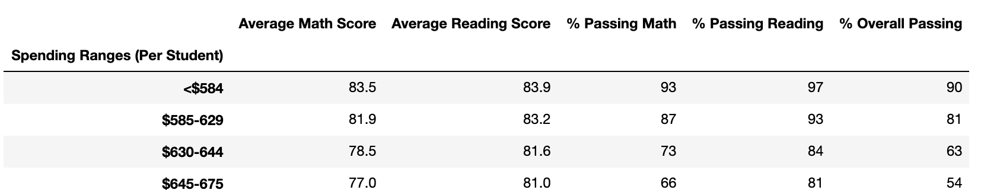

# School_District_Analysis

## Project Overview 
Maria has given us two data sets that contain the information of the students and the schools in the district. We initially clean up the data received by identifying prefix and suffix that are not a part of first and last time in the students data set. After successfully cleaned up the data, we then able to join two data sets to further analyze the factors that drive the student's test scores performance among the schools in the district. The following factors were used to determine the school with high test passing rates: school type, school size, and budget.

## Challenge Overview
Upon the completion of the analysis, the school board has notified Maria and her supervisor that the students_complete.csv file shows evidence of academic dishonesty; specifically, reading and math grades for Thomas High School ninth graders appear to have been altered. Maria has asked us to further analyze the data by replace the math and reading scores for Thomas High School with NaNs while keeping the rest of the data intact. She has also asked us to provide a written report
describe how these changes affected the overall analysis.

## Resources
Data Source: clean_students_complete.csv Software: Python 3.7.2, Jupyter Notebook

## Results

### How is the school and the district summary affected?
Both the school and district summaries remain relatively unchanged with the replacement of the ninth grade scores for Thomas High School. The district's overall passing rate in percentage went down by around 0.01% while Thomas High School overall passing rate in percentage also went down by around 0.03%. The ranking of Thomas High School remain unchanged.

School summary in previous analysis:

School summary in current analysis:

District summary in previous analysis:

District summary in current analysis:

### How does replacing the ninth-grade scores affect the following:

#### Math and reading scores by grade
Math and reading score remain unchanged in the previous and current analysis. 

Math scores by grade:
 
 
Reading scores by grade:
 

#### Scores by school spending
Thompson high school is in the $630-$644 spending range per student and the average math and reading scores remained the same. Scores by school spending is shown below:
 

#### Scores by school size
The average math and reading scores remain unchange when shown based on school size. Scores by school size analysis is shown below:

#### Scores by school type
The average math and reading scores remain unchange when shown based on school type. Scores by school type analysis is shown below:

## Summary
After reading and math scores for the ninth grade at Thomas High School have been replaced with NaNs to only analyze the scores from tenth to twelfth grade student due to academic dishonesty, the average scores are slightly changed. The average math score decreased from 83.41 to 83.35 while the average reading score increased from 83.85 to 83.90. The analysis also shown that the passing percentage of math and reading scores both decreased. After replacing the ninth grade scores, the overall passing percentage decreased from 90.95% to 90.63%. 

We can further improve this analysis by testing if the changes are statistically significant to ensure accurate interpretation.

